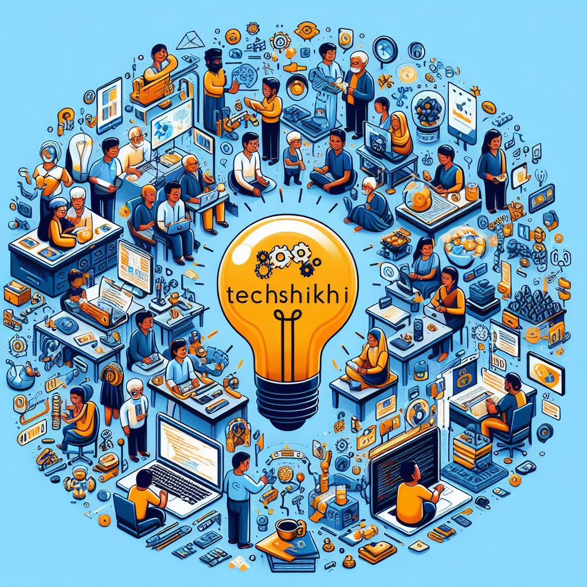

<p align="center">

<br>
<b>Simplifying Complex Tech Concepts in Bengali for Everyone</b>
</p>


# Welcome to TechShikhi! 🎉🌐

This is a community-driven project aimed at breaking down complex tech concepts into simple Bengali, making them accessible to everyone, regardless of their background. 💻🚀

**TechShikhi** offers a vast library of tech topics, from programming languages to machine learning, and everything in between. Each concept is explained in a clear and simple language, with real-world examples to help you understand better. 📚

But that's not all! **TechShikhi** is not just about learning, it's about contributing too! If you have a knack for explaining tech concepts in a simple way, why not share your knowledge with the community? 🤝

So, what are you waiting for? Start exploring, start learning, and start contributing. Let's make technology accessible to all! 🎉

## Installation
To contribute to TechShikhi, follow these steps:

```bash
git clone https://github.com/yourusername/TechShikhi.git
cd TechShikhi
```
## Get Started

New to TechShikhi? Depending on your background, there are multiple ways to learn and contribute:

- If you’re a tech enthusiast
- If you’re a student
- If you’re a professional
- If you’re a teacher

## Contribute

TechShikhi empowers you to contribute your knowledge in a manner that is inherently attuned to learning.

This is particularly beneficial for various scenarios:

- :running: You are passionate about a tech concept: You’re dealing with concepts of varying complexities, each signifying different elements. You desire a platform to logically organize and share them.
- ☁ You are a tech professional: Let’s say you’re a software engineer, data scientist, or AI specialist, and you wish to share your expertise in a precise manner.
- 🗂 You are a teacher: Perhaps you’re teaching computer science or related subjects and want to contribute to the learning resources.

In essence, TechShikhi facilitates knowledge sharing in a way that mirrors Python dataclasses, with learning being an integral component.

## Explore

TechShikhi facilitates the exploration of tech concepts in a manner inherently compatible with learning.

This includes native support for various tech concepts, along with a user-friendly interface for easy navigation.

This feature proves beneficial for several scenarios:

- ☁ You are a learner, perhaps through platforms like Coursera or Udemy
- 🕸 You are a tech enthusiast and need an efficient means of understanding tech concepts
- ⚙ You are a teacher and require a method for explaining tech concepts to your students

So, are you ready to embark on this exciting journey? Let’s get started! 🚀
